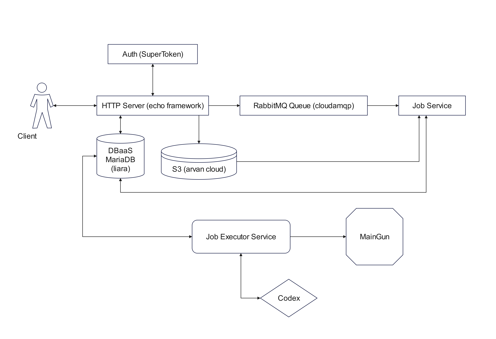

# Cloud job service
An HTTP endpoint service for uploading code and receiving its result

### Architecture


ORM library [Gorm](https://github.com/jinzhu/gorm)

HTTP-Server framework [Echo](https://echo.labstack.com/)

Authentication Service [SuperTokens](https://supertokens.com/)

RabbitMQ Queue [cloudamqp](https://www.cloudamqp.com/)

Database as a Service [liara](https://console.liara.ir/)

S3 Storage [arvan cloud](https://www.arvancloud.ir/)

Mail Service [MailGun](https://www.mailgun.com/)

Code Executor [Codex](https://api.codex.jaagrav.in)

- [Database](#database)
- [API](#api)
- [Package Structure](#package-structure)

## Database
#### Tables :

**uploads:**

 | id(pk) | email        | inputs | program_language               | is_enable | 
|:-------|--------------|--------|--------------------------------|-----------|
| int    | varchar(320) | TEXT   | ENUM('py', 'cpp', 'c', 'java') | bool      |

**jobs:**

| id(pk) | upload(fk) | job_query | job_status                  | 
|:-------|------------|-----------|-----------------------------|
| int    | int        | TEXT      | ENUM('executed', 'suspend') |

**results:**

| id(pk) | job          | output | execute_status              | execute_date | 
|:-------|--------------|--------|-----------------------------|--------------|
| int    | varchar(320) | TEXT   | ENUM('in progress', 'done') | datetime     |

## API 

### Specs:

Authorization is with SuperToken Service.

#### User endpoints:

#### sign up:

`POST /api/auth/signup`

request structure:

`body: json`

```json
{
    "formFields": [
    {
      "id": "email",
      "value": "EMAIL_ADDRESS"
    },
    {
      "id": "password",
      "value": "PASSWORD"
    }
  ]
}
```

#### sign in:

`POST /api/auth/signin`

request structure:

`body: json`

```json
{
    "formFields": [
    {
      "id": "email",
      "value": "EMAIL_ADDRESS"
    },
    {
      "id": "password",
      "value": "PASSWORD"
    }
  ]
}
```

#### upload:

`POST /api/upload`

request structure:

`body: form-data`

| key             | value                   |
|:----------------|-------------------------|
| programFile     | `file path`             |
| inputs          | `argument`              |
| programLanguage | `code language`         |

#### execute:

`POST /api/execute`

request structure:

`body: form-data`

| key | value       |
|:----|-------------|
| id  | `upload id` |

#### jobs status:

`GET /api/jobs/status`

#### uploads info:

`GET /api/uploads/info`

#### session info:

`GET /api/session/info`

#### sign out:

`GET /api/signout`

## Package Structure

```
├─── database                // database functions and models
│    ├─── database.go
│    ├─── DB.sql
│    └─── models
│         ├─── job.go
│         ├─── result.go
│         └─── upload.go
│
├───global                   // global constant, api key, URL, URI
│       constant.go
│
├─── handler                 // handler package for routing and request handling
│    ├─── handler.go
│    ├─── routes.go
│    └─── response
│         └─── models
│              └─── message.go
│
├─── mail-service            // mailgun service function
│    └─── mailgun.go
│
├─── main                    // job executor service, http-server, job service
│    ├─── executor.go
│    ├─── http-server.go
│    └─── job.go
│
├─── postman                 // postman export file
│    └─── Cloud Computing.postman_collection.json
│
├─── rabbitmq                // rabbitmq consumer and producer handler
│    ├─── consumer.go
│    └─── producer.go
│
├─── storage                 // handle S3 Storage
│   └─── storage.go
│
└─── Test Programs           // test program for upload
     └─── Python
          ├─── test1.py
          └─── test2.py
```

## global\constant.go

```go
package global
// constants for accessing cloud service
const (
	// Endpoint Bucket s3 storage constant
	Endpoint = ""
	Bucket   = ""

	// User Password Url Port DBaaS constant
	User     = ""
	Password = ""
	Url      = ""
	Port     = 0

	// Domain ApiPrivateKey From mailgun constant
	Domain        = ""
	ApiPrivateKey = ""
	From          = ""

	// ApiUrl codex api
	ApiUrl = ""

	// CloudamqpUrl CloudAMQP
	CloudamqpUrl = ""

	// URI APIKey SuperTokens
	URI    = ""
	APIKey = ""
)
```